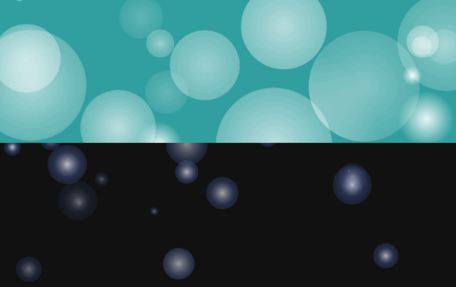

# Bokehfy 

## A small library to add animated bokeh effects to the DOM
[Demo](https://bthegit.github.io/bokehfy/)



## Getting Started

#### In Node.js:

```
npm i -S bokehfy
import bokehfy from 'bokehfy'
```

or 

```
const bokehfy = require('bokehfy')
```


#### In the browser:

Add bokehfy.min.js to your webpage.

```
<script src="https://cdn.jsdelivr.net/npm/bokehfy@0.2.1/lib/bokehfy.min.js"></script>
```

#### Downloaded

Download [Minified library](https://rawgit.com/BtheGit/bokehfy/master/lib/bokehfy.min.js)

```
import bokehfy from './bokehfy.min.js'
```

#### Create a new Bokeh field instance by calling bokehfy()

```
bokehfy()
```

#### Save the result of bokehfy() to a variable to have access to additional methods during runtime.

```
const field = bokehfy()
```
___


## Instantiation parameters
Valid parameters: no parameters, a DOM element, a settings object (with or without a DOM element parent included)

* No parameters:  it will create a full-size instance with default parameters and prepend it to the window.document.body.

    ```
    const field = bokehfy()
    ```

* Valid DOM element: an instance will be created and prepended to the DOM element with default paramters.
    ```
    const container = document.getElementById('container')
    const field = bokehfy(container)
    ```


* Settings object with key/value pair {parent: Valid DOM Element}.
    ```
    const container = document.getElementById('container')

    const settings = {
        backgroundColor: '#00FF00', 
        parent: container
    }

    const field = bokehfy(settings)
    ```

* Settings object with no parent key then the DOM body will be assumed.

    ```
    const setup = {
        dx: 0,
        dy: 0,
        framerate: 10,
        gradient: ['red', 'pink'],
        density: 200,
        radius: 100,
        halflife: 1000,
        transparent: false,
        backgroundColor: '#AAA'
    }

    const field = bokehfy(setup)
    ```   

bokehfy() will return null in the case of an invalid parent element being passed, either alone or in the settings object.

### Valid initial settings parameters:
- parent: DOM Element,
- backgroundColor: string,
- transparent: boolean,
- color: string,
- star: string,
- gradient: array of strings,
- radius: number (0.00001 - 1000),
- halflife: number (0.00001 - 10000),
- density: number (0 - 2000),
- framerate: number (0 - 10000),
- dx: number (0 - 10000),
- dy: number (0 - 10000)

Note: Color, star, and gradient will overwrite each other. JS does not guarantee which order an object will be iterated through and it's not possible to guarantee which value will end up being processed last and therefore displayed.

Note: The canvas object that bokeh creates is absolutely positioned. If the element you attach it to does not have relative positioning set, the canvas may not behave as expected.


---

*bokehfy() makes use of [Tiny Color](https://github.com/bgrins/TinyColor) for color validation and conversion. Any valid CSS color format should work.

If you wish to use a smaller custom version of this library without color verification. You can easily remove Tiny Color from the Bokeh API color methods and it should reduce the bundle size by 60%*

---


## Methods

#### start
```
field.start()
```

#### stop
```
field.stop()
```

#### pause

```
field.pause()
```

Cancel requestAnimationFrame until pause() or start() is called again.

#### delete
```
field.delete()
```

Stop animation, remove window listeners, and remove the field instance from its DOM parent.

#### getSettings
```
const currentState = field.getSettings()
//{
//    transparent: false,
//    backgroundColor: {r: 0, g: 0, b: 0, a: 0.5},
//    gradient: [
//        {r: 255, g: 255, b: 255, a: 1},
//        {r: 255, g: 255, b: 255, a: 1},
//        {r: 255, g: 255, b: 255, a: 1}
//    ],
//    radius: 88,
//    halflife: 450,
//    dx: 5,
//    dy: 0.2,
//    density: 100   
//}
```

Returns an object representing the current field settings. (Individual points will deviate from the inital maximum dx, dy, and radius settings).

NOTE: Colors will be returned as an object with r,g,b,a keys.

#### toggleBackground
```
field.toggleBackground()
```

Toggle background transparency. No parameters.

#### transparent
```
field.transparent(true)
```
*default = false*

Set background transparency by passing a boolean value.

#### backgroundColor
```
field.backgroundColor('purple')
field.backgroundColor('#00FF00')
```
*default = 'rgba(49, 159, 159, 1)'*

Set new background color by passing a valid color as a string. Alpha values are supported for background color.

### color
```
field.color('#ABC')
```
*no default*

Creates a solid color point with no gradient. Equivalent to calling gradient with an array with one element. eg ```field.gradient(['white])```
*Alpha values not supported (auto generated)*

#### gradient
```
field.gradient(['white'])
field.gradient(['orangered', 'salmon'])
field.gradient(['white', 'red', 'blue'])
```
*default = ['white', 'white', 'white']*

Accepts an array of colors in order of colorstop from 0-1 (more than three will be truncated to the first three).

* One color will create a solid color point with no gradient.
* Two colors will create a gradient with the first color at stop 0 and the second at stop 1.
* Three colors will create a gradient with the first color at stop 0, the third at stop 1, and the second at a randomized stop somewhere between 0.4 and 0.6.
*Alpha values not supported (auto generated)*


#### star
```
field.star('blue')
```
*no default*

Passing a single color will create a 3 stop gradient using white as the first stop and the passed color as the next two.
*Alpha values not supported (auto generated)*


#### radius

```
field.radius(10)
```
*default = 120*

Pass valid number. Accepted range is 0.00001 - 1000. Valid numbers outside that range will be coerced to the nearest acceptable value.

#### stepRadius

```
field.stepRadius(0.5)
```

Pass valid number. Current radius will be incremented by passed value. 

NOTE: If you increment the radius value directly with field.radius(), it will be randomized as if initially seeding. Use this method for smooth animations.

NOTE: If you seed radius at 0, all values will be equal sized. To have a range of point sizes, seed with a non-zero value before animating with this function.

#### halflife
```
field.halflife(500)
```
*default = 750*

Pass valid number. Accepted range is 0.00001 - 10000. Valid numbers outside that range will be coerced to the nearest acceptable value.

Halflife and radius work hand in hand. To better understand the relationship, you may want to play with the [demo](https://bthegit.github.io/bokehfy/)

#### density
```
field.density(100)
```
*default = 90*

Increase the number of points. Pass valid number. Accepted range is 0 - 2000. Valid numbers outside that range will be coerced to the nearest acceptable value.

Abusing the density is the quickest way to 'hot lap syndrome'

#### framerate
```
field.framerate(5)
```
*default = 30*

Pass valid number. Accepted range is 0 - 10000. Valid numbers outside that range will be coerced to the nearest acceptable value.

#### dx
```
field.dx(0)
```
*default = 2*

Horizontal point speed. Pass valid number. Accepted range is 0 - 10000. Valid numbers outside that range will be coerced to the nearest acceptable value.

#### stepDx
```
field.stepDx(0.5)
```

Pass valid number. Current dx will be incremented by passed value. 
NOTE: If you increment the dx value directly with field.dx(), it will be randomized as if initially seeding. Use this method for smooth animations.


#### dy
```
field.dy(10)
```
*default = 2*

Vertical point speed. Pass valid number. Accepted range is 0 - 10000. Valid numbers outside that range will be coerced to the nearest acceptable value.

#### stepDy
```
field.stepDy(0.5)
```

Pass valid number. Current dy will be incremented by passed value. 
NOTE: If you increment the dy value directly with field.dy(), it will be randomized as if initially seeding. Use this method for smooth animations.

#### settings
```
const setup = {
    dx: 0,
    dy: 0,
    framerate: 10,
    gradient: ['red', 'pink'],
    density: 200,
    radius: 100,
    halflife: 1000,
    transparent: false,
    backgroundColor: '#AAA'
}

field.settings(setup)
```
Allows you to pass an object with multiple settings during runtime. The object takes the same values as the initial setup object (except for parent which will be disregarded) - see instantiation parameters section for valid keys.

---

NOTE:
